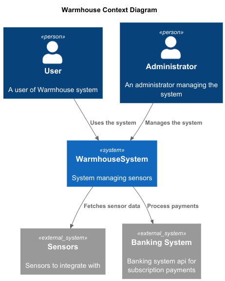
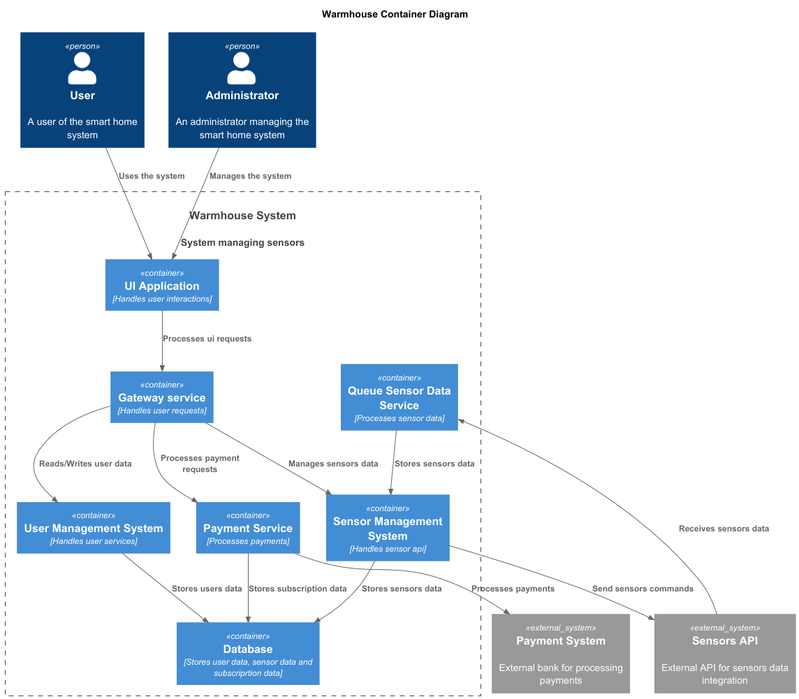
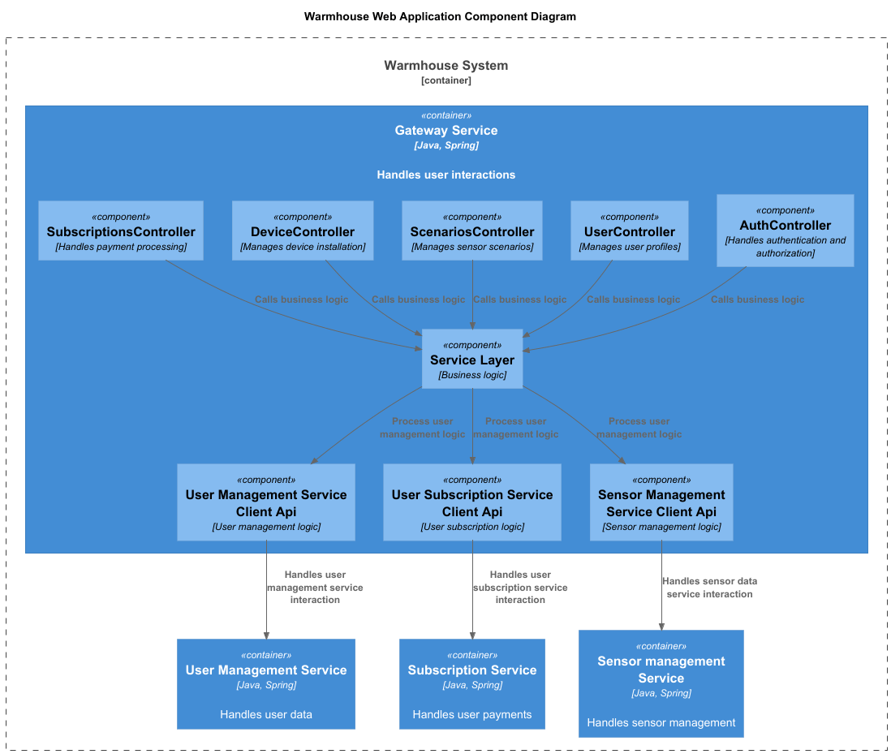
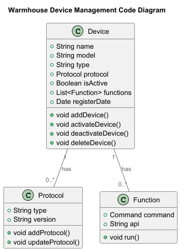
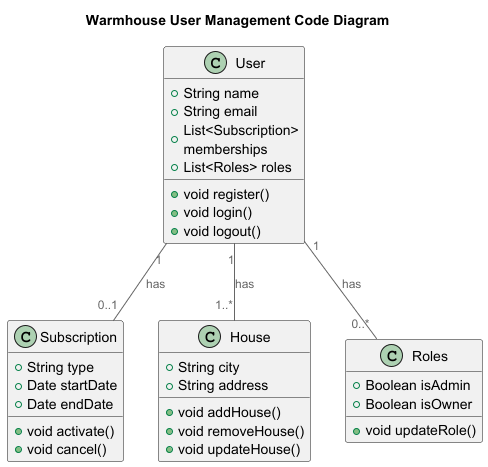
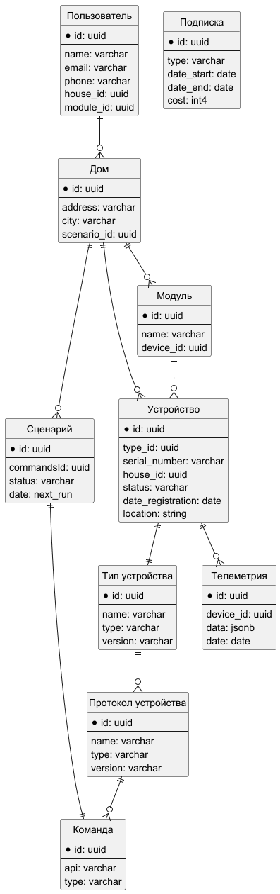

# Project_template

Это шаблон для решения проектной работы. Структура этого файла повторяет структуру заданий. Заполняйте его по мере работы над решением.

# Задание 1. Анализ и планирование

<aside>

Чтобы составить документ с описанием текущей архитектуры приложения, можно часть информации взять из описания компании и условия задания. Это нормально.

</aside

### 1. Описание функциональности монолитного приложения

**Управление отоплением:**

- Пользователи могут удалённо включать/выключать отопление в своих домах
- Система поддерживает управление(добавление/изменение/удаление) контроллеров отопительной системы
специалистом по подключению системы отопления

**Мониторинг температуры:**

- Пользователи могут получать данные о температуре с датчиков, установленных в домах.
- Пользователи могут просматривать текущую температуру в своих домах через веб-интерфейс
- Система поддерживает управление(добавление/изменение/удаление) датчиков температуры
  специалистом по подключению систем умного дома

### 2. Анализ архитектуры монолитного приложения

Язык программирования: Go
База данных: PostgreSQL
Архитектура: Монолитная, все компоненты системы (обработка запросов, бизнес-логика, работа с данными) находятся в рамках одного приложения.
Взаимодействие: Синхронное, запросы обрабатываются последовательно.
Масштабируемость: Ограничена, так как монолит сложно масштабировать по частям.
Развертывание: Требует остановки всего приложения.

### 3. Определение доменов и границы контекстов

AS IS
1) Домен: Управление устройствами:
- поддомен: Работа системы с устройствами умного дома:
    - контекст: управление подключением устройств
    - контекст: контроль состояния устройств
    - контекст: обработка команд для устройств умного дома
    - контекст: ведение журнала телеметрии
- поддомен: Управление функционалом устройств
    - контекст: управление функционалом, поддерживаемого системой
    - контекст: управление функционалом устройств
- поддомен: Управление пользователями:
    - контекст: управление пользователями

TO BE
1) Домен: Управление устройствами:
  - поддомен: Работа системы с устройствами умного дома:
    - контекст: управление подключением устройств
    - контекст: контроль состояния устройств
    - контекст: обработка команд для устройств умного дома
    - контекст: ведение журнала телеметрии
  - поддомен: Работа системы со сценариями
    - контекст: управление пользовательскими сценариями
    - контекст: управление устройства умного дома в соответствии со сценариями
  - поддомен: Управление протоколами устройств
    - контекст: управление поддерживаемыми протоколами устройств
    - контекст: управление списком поддерживаемых устройств
  - поддомен: Управление функционалом устройств
    - контекст: управление функционалом, поддерживаемого системой
    - контекст: управление функционалом устройств
2) Домен: Работа с пользователями
  - поддомен: Управление доступом пользователей
    - контекст: управление авторизацией
  - поддомен: Управление пользователями:
      - контекст: управление пользователями
      - контекст: управление правами пользователей
  - поддомен: управление подписками на сервис:
    - контекст: обработка транзакций
    - контекст: ведение журнала подписок


### **4. Проблемы монолитного решения**

- Сложность масштабирования решения. Вертикальное масштабирование подразумевает необходимость увеличения ресурсов выделенных на всю 
систему в случае роста нагрузки на какой то один функционал (например увеличения количества датчиков)
- Сложность разработки системы большой командой разработчиков - одни изменения влияют на всю систему
- Низкая скорость разработки и развертывания монолита - необходимость тестирования всего приложения

### 5. Визуализация контекста системы — диаграмма С4

Добавьте сюда диаграмму контекста в модели C4.

Чтобы добавить ссылку в файл Readme.md, нужно использовать синтаксис Markdown. Это делают так:

[Диаграмма контекста C4](diagrams/context/Context.puml)



# Задание 2. Проектирование микросервисной архитектуры

В этом задании вам нужно предоставить только диаграммы в модели C4. Мы не просим вас отдельно описывать получившиеся микросервисы и то, как вы определили взаимодействия между компонентами To-Be системы. Если вы правильно подготовите диаграммы C4, они и так это покажут.

**Диаграмма контейнеров (Containers)**

Добавьте диаграмму.
[Диаграмма контейнеров](diagrams/container/Container.puml)


**Диаграмма компонентов (Components)**

[Диаграмма компонентов](diagrams/component/Component.puml)

**Диаграмма кода (Code)**

[Диаграмма кода](diagrams/code/Code_Device_Management.puml)



[Диаграмма кода](diagrams/code/Code_User_Management.puml)

# Задание 3. Разработка ER-диаграммы

[ER диаграмма](diagrams/ER/ER_user.puml)



# Задание 4. Создание и документирование API

### 1. Тип API

Для взаимодействия между микросервисами предлагаю использовать Rest Api, так как пользователь ожидает немедленный ответ от сервиса при выполнении операций
Для взаимодействия с датчиками предлагаю использовать асинхронной взаимодействие через очередь для получения данных от сенсоров,
так как объем данных может быть достаточно большим по мере развития системы и необходимо иметь возможность обрабатывать данные без потерь, 
при этом пользователь может не ждать онлайн информации от сенсоров, получая последние доступные данные телеметрии из БД

### 2. Документация API
[Документация API Sensor Management Service OpenApi](diagrams/api/Sensor_Management_Service_openapi.yaml)

[Документация API User Management Service OpenApi](diagrams/api/User_Management_Service_openapi.yaml)

[Документация API Subscription Management Service OpenApi](diagrams/api/Subscription_Service_openapi.yaml)

[Документация API Sensor Data Async API](diagrams/api/Sensor_Data_AsyncApi.yaml)

# Задание 5. Работа с docker и docker-compose

Перейдите в apps.

Там находится приложение-монолит для работы с датчиками температуры. В README.md описано как запустить решение.

Вам нужно:

1) сделать простое приложение temperature-api на любом удобном для вас языке программирования, которое при запросе /temperature?location= будет отдавать рандомное значение температуры.

Locations - название комнаты, sensorId - идентификатор названия комнаты

```
	// If no location is provided, use a default based on sensor ID
	if location == "" {
		switch sensorID {
		case "1":
			location = "Living Room"
		case "2":
			location = "Bedroom"
		case "3":
			location = "Kitchen"
		default:
			location = "Unknown"
		}
	}

	// If no sensor ID is provided, generate one based on location
	if sensorID == "" {
		switch location {
		case "Living Room":
			sensorID = "1"
		case "Bedroom":
			sensorID = "2"
		case "Kitchen":
			sensorID = "3"
		default:
			sensorID = "0"
		}
	}
```

2) Приложение следует упаковать в Docker и добавить в docker-compose. Порт по умолчанию должен быть 8081

3) Кроме того для smart_home приложения требуется база данных - добавьте в docker-compose файл настройки для запуска postgres с указанием скрипта инициализации ./smart_home/init.sql

Для проверки можно использовать Postman коллекцию smarthome-api.postman_collection.json и вызвать:

- Create Sensor
- Get All Sensors

Должно при каждом вызове отображаться разное значение температуры

Ревьюер будет проверять точно так же.


